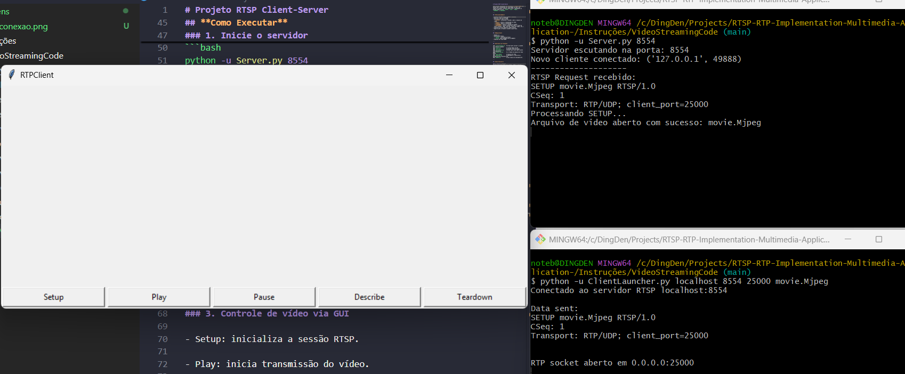
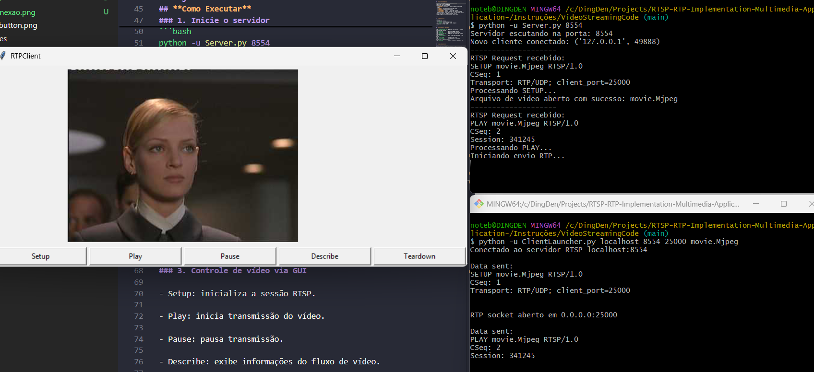
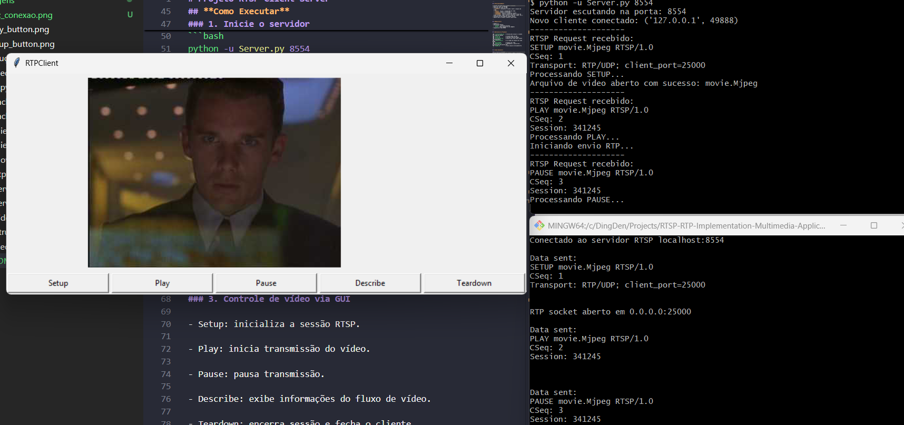
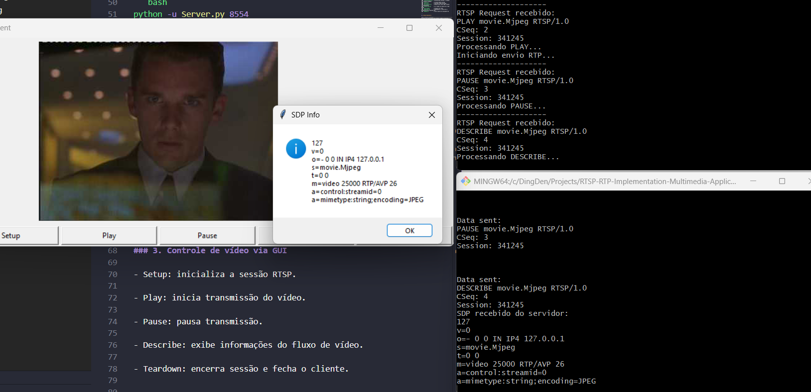
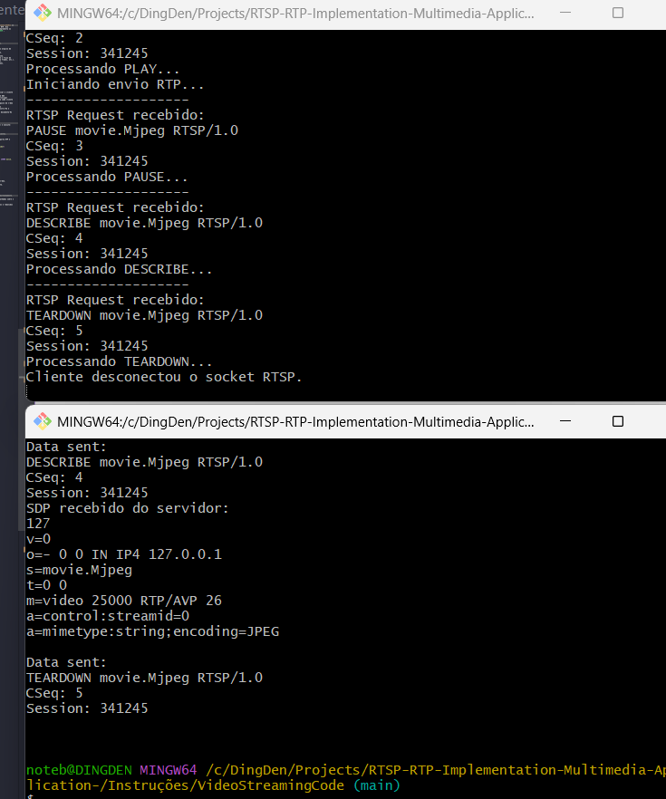

# Projeto RTSP Client-Server

Este projeto implementa um **servidor e cliente RTSP** em Python para transmissão de vídeo MJPEG via RTP. Ele suporta múltiplos clientes simultâneos e implementa os métodos RTSP básicos: `SETUP`, `PLAY`, `PAUSE`, `TEARDOWN` e `DESCRIBE`.

---

## **Funcionalidades**

- Conexão TCP RTSP entre cliente e servidor.
- Envio de vídeo via RTP/UDP.
- Controles de vídeo via GUI:
  - **SETUP**: inicializa a sessão e abre o arquivo de vídeo.
  - **PLAY**: inicia a transmissão do vídeo.
  - **PAUSE**: pausa a transmissão.
  - **TEARDOWN**: encerra a sessão do cliente.
  - **DESCRIBE**: retorna informações sobre o fluxo de mídia (formato, codec, duração, número de frames, etc.).
- Interface gráfica amigável usando Tkinter.
- Suporte para múltiplos clientes simultâneos.

---

## **Requisitos**

- Python 3.x
- Bibliotecas Python:
  - `tkinter` (interface gráfica)
  - `Pillow` (para manipulação de imagens)
- Arquivos de vídeo MJPEG

---

## **Estrutura do Projeto**

Instruções/VideoStreamingCode/
├── `ClientLauncher.py`  # Script para iniciar o cliente via linha de comando
├── `Client.py`           # Cliente RTSP com GUI
├── `Server.py`           # Servidor RTSP principal
├── `ServerWorker.py`     # Worker que trata cada cliente individualmente
├── `VideoStream.py`      # Lê frames do arquivo de vídeo MJPEG
├── `movie.Mjpeg`         # Arquivo de vídeo
├── `RtpPacket.py`        # Implementa a construção e decodificação de pacotes RTP
Imagens/
├── `describe_button.png` # Imagem que mostra a função describe
├── `inic_conexao.png`    # Imagem que mostra a conexão cliente-servidor
├── `pause_button.png`    # Imagem que mostra a função pause
├── `play_button.png`     # Imagem que mostra a função play
├── `setup_button.png`    # Imagem que mostra a função setup
├── `teardown_button.png` # Imagem que mostra a função teardown
`README.md`               # Este arquivo de documentação

---

## **Como Executar**

### 1. Inicie o servidor
Escolha uma porta livre (por exemplo, 8554) e execute:

```bash
python -u Server.py 8554
```
O servidor ficará escutando conexões de clientes.

### 2. Inicie o cliente
Forneça endereço do servidor, porta RTSP, porta RTP e arquivo de vídeo:

```bash
python -u ClientLauncher.py <endereço_servidor> <porta_rtsp> <porta rtp> <arquivo_video>
```

Exemplo:

```bash
python -u ClientLauncher.py localhost 8554 25000 movie.Mjpeg
```

Exemplo de um cliente conectado ao servidor:


### 3. Controle de vídeo via GUI

- Setup: inicializa a sessão RTSP.



- Play: inicia transmissão do vídeo.



- Pause: pausa transmissão.



- Describe: exibe informações do fluxo de vídeo.



- Teardown: encerra sessão e fecha o cliente.



## Autores

**1. Daniel Diniz**
**2. Mateus Bastos**
**3. Matheus Azevedo**